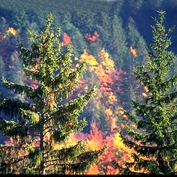

# AI Concetration S8 APP2

L'objectif de ce code est de classifier un ensemble d'images en 3 environnements, soit: les plages, les forêts et les villes. En se basant sur des principes statistiques et observables, nous avons déterminé un ensemble de représentations permettant de discerner les différences entre ces environnements. Puis, nous avons comparé la performance de 3 différents classificateurs: Un réseau de neurones, un classificateur Bayésien et un classificateur en deux étapes avec k-ppv basé sur un centroide de k-mean.

L'exécution du code se fait en 2 parties: la génération des représentations et la classification

## Génération des représentations
Des fichiers pré-générés (`data/data_3classes_app/`) sont inclus au répertoire, pour permettre de sauter cette étape. Pour générer ces fichiers de pré-traitement, lancer le script `pretreatementOfData.py`.
> Important: veuillez ouvrir les fichiers `C1.txt`, `C2.txt` et `C3.txt` et mettre le même nombre de lignes dans chacun. Éffacer les lignes jusqu'au nombre de lignes minimum des 3 fichiers.

## Classification
Simplement lancer le script `problematique.py`. Modifier le script au besoin pour (dés)activer les classificateurs au choix.